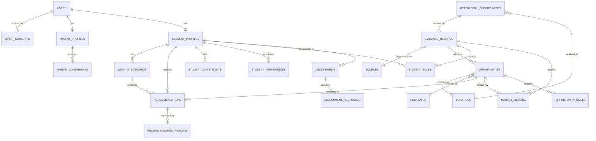

# M63 — Database Schema & Data Architecture Specification

## 1. Overview & Principles

The M63 data store is architected to preserve **truth, provenance, and mathematical auditability**:
- **Separation of Concerns**: User profile and constraints, evidence provenance, dynamic opportunities, and decision results are isolated into distinct normalized tables.
- **Provenance by Design**: Every external market metric and opportunity record links directly to an immutable `evidence_records` entry.
- **Zero Fabrication**: Nullable fields are treated as `NULL` / `UNKNOWN`, never defaulted to `0` or synthetic filler.
- **Dual Support**: Designed to run natively with SQLite during local hackathon development and test suites, with full schema parity for PostgreSQL in staging/production environments.

---

## 2. Entity Relationship Diagram (ERD) Overview

---

## 3. Detailed Entity Definitions

### 3.1 Authentication & User Identities
- `users`: Core authentication identity (`id`, `email`, `password_hash`, `role` [STUDENT, PARENT, COUNSELOR, ADMIN], `is_active`, `created_at`, `updated_at`).
- `minor_consents`: Audit log for student minor validation (`id`, `student_user_id`, `guardian_name`, `guardian_email`, `guardian_phone`, `consent_given_at`, `consent_version`, `ip_address`).

### 3.2 Student Intelligence Models
- `student_profiles`:
  - `id`, `user_id` (1:1 with `users`)
  - `date_of_birth`, `age` (computed/verified)
  - `education_level` (SCHOOL_SECONDARY, SCHOOL_HIGHER_SECONDARY, COLLEGE_UNDERGRAD, COLLEGE_POSTGRAD)
  - `class_or_year`, `academic_stream` (SCIENCE, COMMERCE, ARTS, VOCATIONAL, ENGINEERING, etc.)
  - `location_id`
  - `preferred_language`
  - `academic_data` (JSON: subjects, subject-wise scores, strongest subjects, weakest subjects, trend)
  - `aptitude_data` (JSON: logical, numerical, verbal, abstract, spatial, analytical)
  - `riasec_scores` (JSON: realistic, investigative, artistic, social, enterprising, conventional $\in [0, 100]$)
  - `work_preferences` (JSON: analytical_vs_creative, individual_vs_team, practical_vs_theoretical, structured_vs_flexible)
  - `risk_and_mobility` (JSON: relocate_domestic, relocate_international, unconventional_tolerance, loan_willingness)
- `student_skills`:
  - `id`, `student_id`, `skill_name`, `skill_category`, `proficiency_level` (BEGINNER, INTERMEDIATE, ADVANCED, EXPERT)
  - `evidence_level` (CLAIMED, EVIDENCE_BACKED, ASSESSED, EXTERNALLY_VERIFIED)
  - `evidence_record_id` (Foreign key to `evidence_records`, nullable)

### 3.3 Parent Intelligence Models
- `parent_profiles`:
  - `id`, `user_id`, `linked_student_id`
  - `annual_income_range` (Range bracket e.g. "INR_3_TO_6_LAKH")
  - `dependents_count`
  - `education_budget_annual` (Decimal / numeric, nullable)
  - `max_total_budget` (Decimal / numeric)
  - `loan_willingness` (NONE, LOW, MODERATE, HIGH)
  - `max_loan_tolerance` (Decimal / numeric)
  - `risk_profile` (CONSERVATIVE, MODERATE, HIGH)
  - `government_sector_preference` (Boolean or weight 0-1)
  - `geographic_mobility_tolerance` (SAME_CITY, SAME_STATE, DOMESTIC_ONLY, INTERNATIONAL_ALLOWED)
  - `max_time_to_income_years` (Integer: 1-2, 3-4, 5-6, 7+)
  - `non_financial_constraints` (JSON: family_responsibilities, physical_limitations, location_bounds)

### 3.4 Evidence & Provenance
- `sources`:
  - `id`, `name` (e.g. "Ministry of Statistics & Programme Implementation", "O*NET 28.0", "UGC India")
  - `base_url`, `source_type` (OFFICIAL_GOVERNMENT, INDUSTRY_CONSORTIUM, ACADEMIC_INSTITUTE, DIRECT_PORTAL)
  - `reliability_rating` (0.0 to 1.0)
- `evidence_records`:
  - `id`, `source_id`, `field_name`, `raw_value` (JSON/Text), `parsed_value` (JSON)
  - `source_url` (Direct verification URL for transparent fallbacks)
  - `evidence_status` (VERIFIED, PARTIAL, EXTERNAL, INSUFFICIENT)
  - `evidence_level` (OFFICIAL_SOURCE, EXTERNALLY_VERIFIED, ASSESSMENT, PROJECT_EVIDENCE, CERTIFICATE, SELF_DECLARED)
  - `published_at`, `retrieved_at`
  - `geography_country`, `geography_region`, `geography_city`
  - `method` (API_INGESTION, VERIFIED_SCRAPE, AUDITED_DATASET)
  - `coverage_score` (0.0 to 1.0)
  - `confidence_score` (0.0 to 1.0)

### 3.5 Dynamic Opportunities & Market Metrics
- `opportunities`:
  - `id`, `title`, `taxonomy_code` (e.g. NCO-2015 or O*NET SOC code, optional normalization)
  - `role_category`, `description`
  - `company_id` (nullable), `location_id` (nullable)
  - `work_model` (ONSITE, HYBRID, REMOTE)
  - `salary_min`, `salary_max`, `salary_currency`, `salary_is_verified` (Boolean)
  - `salary_evidence_id` (nullable reference to `evidence_records`)
  - `opportunity_riasec` (JSON: realistic, investigative, artistic, social, enterprising, conventional)
  - `education_level_required`
  - `status` (ACTIVE, HISTORICAL, UNVERIFIED)
- `market_metrics`:
  - `id`, `opportunity_id` or `taxonomy_code`
  - `metric_type` (DEMAND_INDEX, JOB_VELOCITY, ECONOMIC_DISRUPTION, SOCIO_ECONOMIC_MOBILITY)
  - `metric_value` (Numeric)
  - `forecast_category` (GROWING, STABLE, DECLINING, UNKNOWN)
  - `evidence_record_id` (Mandatory linkage to provenance)

### 3.6 Hyper-Local STEAM Opportunities
- `hyperlocal_opportunities`:
  - `id`, `title`, `domain` (ENVIRONMENT, AGRICULTURE, TEXTILES, HEALTHCARE, RENEWABLE_ENERGY, WATER)
  - `location_id`, `target_locality` (e.g. "Tiruppur District", "Vellore Ranipet Cluster")
  - `local_problem_statement`
  - `local_industry_partner` (nullable)
  - `steam_action_type` (PROJECT_PROTOTYPE, MSME_APPRENTICESHIP, INNOVATION_CHALLENGE)
  - `student_skill_prerequisites` (JSON array)
  - `evidence_record_id`

### 3.7 PRISM Decisions, Recommendations & What-If
- `recommendations`:
  - `id`, `student_id`, `opportunity_id`, `what_if_scenario_id` (null if base evaluation)
  - `fit_score` (0-100), `confidence_score` (0-100, strictly separate)
  - `interest_fit_score`, `skill_fit_score`, `financial_fit_score`, `mobility_fit_score`
  - `financial_feasible` (Boolean, false if hard budget/loan violated)
  - `parent_conflict_index` (0-1)
  - `payback_period_years` (Decimal, null if salary is unknown)
  - `created_at`
- `recommendation_reasons`:
  - `id`, `recommendation_id`
  - `reason_type` (WHY_THIS, WHY_NOT_ALTERNATIVE, SENSITIVITY_TRIGGER)
  - `dimension_name`, `explanation_text`, `metric_delta`
- `what_if_scenarios`:
  - `id`, `student_id`, `scenario_name`
  - `delta_params` (JSON: e.g. `{"budget_delta": 200000, "relocation_override": "INTERNATIONAL"}`)
  - `created_at`
